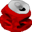
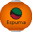
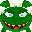

# Projekt z przedmiotu Technologie Gier Komputerowych 2026

## Tytuł gry: *Sober Students*

## Fabuła

Krakowscy studenci są bardzo źli, gdyż Smok Wawelski i jego smoczątka ukradli im rzecz niezbędną do przeżycia. Korzystając z wiedzy nabytej w czasie studiów, starają się odzyskać skradzione przedmioty.

## Koncept

Gra 2D inspirowana grą Angry Birds. Głównym zadaniem gracza jest zbijanie smoczątek, przechodząc przez kolejne poziomy.  
Gracz posiada ograniczoną liczbę zasobów, którą musi wykorzystać do przejścia poziomu. Po przejściu poziomu gracz otrzymuje wynik, obliczony na podstawie ilości zużytych zasobów i stopnia dokonanych zniszczeń.  
Poziomy będą zbudowane obiektów o różnych kształtach, wykonanych z różnego rodzaju materiałów, o różnej wytrzymałości na uszkodzenia. W strukturach znajdują się przeciwnicy, których trzeba zbijać.  
Poziom się kończy, gdy wszyscy przeciwnicy zostaną zbici, a obiekty przestaną się przemieszczać (bądź minie określona ilość czasu).

## Narzędzia

Silnik:

**[Archimedes](https://github.com/AGH-Code-Industry/archimedes)**

Języki programowania:

- **`C++`** (silnik, logika gry, ...) 
- **`JSON`** (format poziomów)

Biblioteki:

- [Box2D](https://box2d.org/)
- [JSON for modern C++ / Nlohmann JSON](https://github.com/nlohmann/json)
- [Boost](https://www.boost.org/)

Inne narzędzia:

- GIMP

## Uruchamianie:

1. Gra została zbudowana na system Windows na platformę `x64` oraz wymaga wsparcia technologii Vulkan
2. Grę należy pobrać ze strony [https://chris-pp.itch.io/sober-students](https://chris-pp.itch.io/sober-students) (`SoberStudents.zip`)
3. Z tej samej strony należy pobrać i zainstalować **`minecraft_font.ttf`**
4. Należy zainstalować paczki redystrybujcyjne Visual C++ 2022 [https://learn.microsoft.com/pl-pl/cpp/windows/latest-supported-vc-redist?view=msvc-170#latest-supported-redistributable-version](https://learn.microsoft.com/pl-pl/cpp/windows/latest-supported-vc-redist?view=msvc-170#latest-supported-redistributable-version) (opcja `x64`)
5. Należy rozpakować pobrane archiwum SoberStudents.zip i uruchomić `main.exe`

## Opis mechanik

### Menu główne

W menu głównym widoczne jest logo gry, przycisk :arrow_forward: rozpoczynający rozgrywkę, tło oraz latające losowo obiekty, które można spotkać w grze.

### Świat gry

Gra jest podzielona na 3 poziomy. W każdym poziomie znajdują się:
- proca
- puszki
- struktury
- smoczątka

### Sterowanie:

- Esc - powrót to menu głównego
- R/🔁 - rozpoczęcie poziomu od nowa
- Spacja/Enter/➡️ - przejście do kolejnego poziomu (po wygranej)
- Scroll w górę - przybliżanie kamery
- Scroll w dół - oddalanie kamery
- Scroll wciśnięty + poruszanie myszą - poruszanie kamerą
- Wciśnięcie i przytrzymanie Lewego przycisku myszy na puszce na procy - naciąganie puszek na procy
- Pusczenie Lewego przycisku myszy - wystrzelenie puszki
- Wciśnięcie Lewego przycisku myszy w dowolne miejsce - użycie mocy wystrzelonej puszki

### Proca

Proca jest głównym elementem interakcji gracza ze światem gry. Pozwala na naciąganie i wystrzeliwanie puszek. Im silniej naciągnięto procę, tym szybciej wystrzeli puszkę.

### Puszki

Puszki są narzędziami destrukcji dostępnymi dla gracza. Potrafią przewracać struktury i zabijać smoczątka. Za zwycięstwo gracz otrzymuje 10000 punktów za każdą niewykorzystaną puszkę.

##### Zwykła puszka

Zwykła, zgnieciona puszka. Po trafieniu przewraca struktury lub zabija smoczątka.

##### Eksplodująca puszka

Spuchnięta puszka, do której ktoś wrzucił dużo miętówkek. Gdy w coś uderzy, staje się niestabilna i w niedługim czasie wybucha. Po wciśnięciu LPM natychmiast wybucha. Siła eksplozji oddziałuje wyłącznie na pobliskie obiekty.

##### Przyspieszająca puszka

Spuchnięta puszka, do której ktoś wrzucił mniej miętówkek. Jest na tyle stabilna, że nie wybuchnie przy zderzeniu z innym obiektem. Jednak zgromadzone w niej ciśnienie pozwala jej przyspieszyć gdy zostanie otworzona.

##### Smoczątka

Smoczątka są głównymi przeciwnikami w grze. Aby wygrać poziom, należy zbić wszystkie smoczątka w danym poziomie. Za zbicie smoczątka dostaje się 5000 punktów.

##### Struktury/Materiały

Struktury drewniane charakteryzują się niską masą, przez co łatwo jest je przewrócić lub zniszczyć.

Struktury kamienne charakteryzują się większą masą, przez co ciężej jest je przewrócić lub zniszczyć, lecz gdy to się uda, zadają znaczne obrażenia. Można to wykorzystać aby łatwiej przechodzić niektóre poziomy.

Przewracanie struktur dodaje liczbę punktów zależną od obrażeń zadanych obiektowi. Po zniszczeniu elementu struktury gracz dostaje większą ilość punktów.

##### Punkty

W górnym prawym roku ekranu znajduje się licznik punktów.

## Assety

Większość assetów wykonano ręcznie w programie GIMP. Tła poziomów pobrano z internetu i poddano lekkiej obróbce.

## Wykorzystanie AI

Próbowano wykorzystać AI do układania poziomów, jednak ze względu na słabe zrozumienie przestrzenne, ułożone poziomy były niestabilne i rozpadały się same z siebie.

## Zrzuty ekranu z gry

